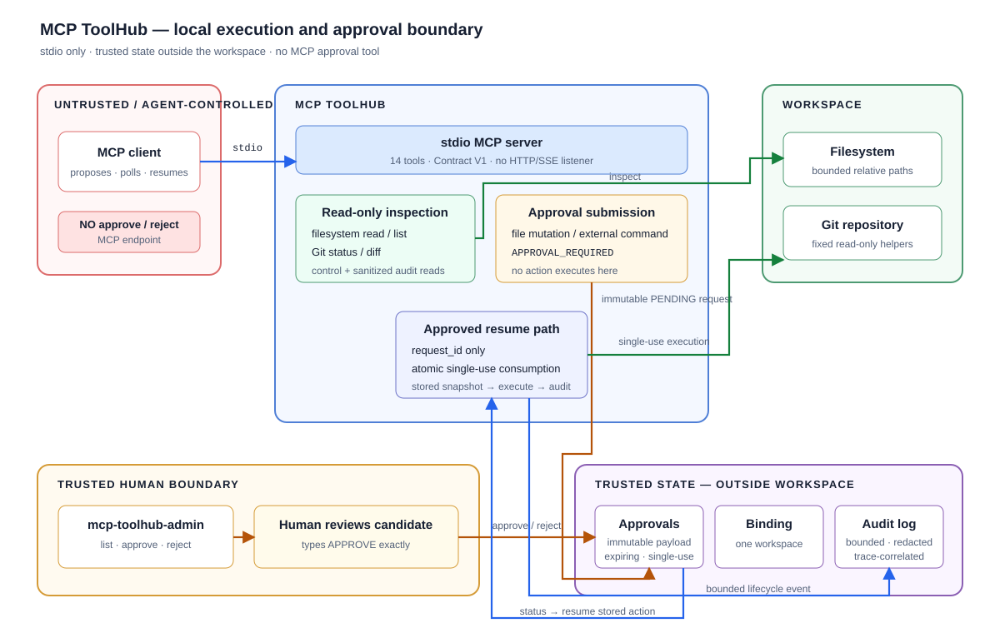

# MCP ToolHub

[](https://github.com/zhihaochen67/mcp-toolhub/actions/workflows/ci.yml)
[](LICENSE)
[](https://www.python.org/)

MCP ToolHub is a local, stdio-only Model Context Protocol (MCP) execution
gateway for AI agents. It lets an agent inspect a bounded workspace and Git
repository directly, while routing file mutations and every external command
through an immutable, expiring, single-use request that only a human can
approve.

It is deliberately small in surface area: 14 production tools, Contract V1
structured outcomes, no network listener, and no MCP endpoint for approval.
The interesting work is at the execution boundary—turning an untrusted tool
request into a bounded, reviewable, replay-resistant local action.



### Why it is different

| Boundary | What ToolHub does |
| --- | --- |
| Human-only approval | The MCP client can submit and observe requests, but only the separate `mcp-toolhub-admin` process can approve or reject them. |
| Immutable execution snapshots | Approved writes, patches, and commands resume from protected state, expire, and are consumed exactly once. |
| Confined and observable execution | Workspace paths are bounded; subprocess output, runtime, and audit reads are capped; lifecycle events share a `trace_id`. |

## See it in 90 seconds

The [demo](docs/demo.md) initializes the server, lists exactly 14 tools, reads
a file, pauses a write at `APPROVAL_REQUIRED`, resumes it after human approval,
shows the correlated audit trail, and proves replay is refused.

## Quick start

Requires Python 3.12 or newer and [uv](https://docs.astral.sh/uv/).

Install the two commands from a source checkout:

```text
uv tool install .
```

Point ToolHub at an existing absolute workspace. A separate state root is
optional but useful when demonstrating the trust boundary:

```text
export TOOLHUB_WORKSPACE_ROOT=/home/alice/projects/example
export TOOLHUB_STATE_ROOT=/home/alice/.local/state/mcp-toolhub-example
mcp-toolhub serve
```

In normal use, an MCP client starts `mcp-toolhub serve` as its stdio child
process. The server writes protocol messages only to stdout and opens no
HTTP/SSE listener.

For human review, open a separate terminal with the same two environment
variables:

```text
mcp-toolhub-admin list
mcp-toolhub-admin approve REQUEST_ID
# inspect the snapshot, then type APPROVE exactly
```

Windows PowerShell setup, MCP client JSON, default state locations,
maintenance, and troubleshooting are in [Operations](docs/operations.md).

For development, `uv sync --all-groups` creates the project environment and
editable install with the locked test and lint dependencies. This is distinct
from the normal `uv tool install .` source installation.

## Architecture at a glance

The MCP client is untrusted. It receives direct access only to bounded
inspection and control tools. An initial mutation or external-command call
validates its input and stores the exact proposed action in trusted state
outside the workspace; it does not perform that action.

The administrator reviews the protected snapshot out of band. After approval,
the client can invoke only the matching resume tool with the `request_id`.
ToolHub atomically consumes the approval before executing the stored action,
preventing replay.

```text
initial tool -> APPROVAL_REQUIRED -> PENDING
             -> human approve/reject
             -> APPROVED / REJECTED / EXPIRED
             -> resume tool -> execution result -> CONSUMED
```

Read the [architecture and threat model](docs/architecture.md) for trust
boundaries and guarantees, and the
[approval lifecycle](docs/approval-lifecycle.md) for Contract V1 client logic.

## Production tool surface

The production server exposes exactly 14 MCP tools:

| Tool | Purpose | Execution class |
| --- | --- | --- |
| `toolhub.ping` | Check server reachability | Direct control; default SDK annotations |
| `toolhub.audit_recent` | Read recent sanitized audit metadata | Direct read-only |
| `toolhub.capabilities` | Discover Contract V1, mappings, and public limits | Direct read-only |
| `toolhub.request_status` | Observe effective request state | Direct read-only; never approves or consumes |
| `filesystem.list_directory` | List bounded workspace entries | Direct read-only |
| `filesystem.read_file` | Read a bounded UTF-8 workspace file and hash | Direct read-only |
| `git.status` | Inspect repository status | Direct read-only |
| `git.diff` | Inspect staged or unstaged diff | Direct read-only |
| `filesystem.write_file` | Validate and submit an exact file write | Approval submission; does not write |
| `filesystem.write_file_approved` | Resume the stored write by request ID | Approval-gated, single-use execution |
| `filesystem.apply_patch` | Validate and submit a single-file patch | Approval submission; does not patch |
| `filesystem.apply_patch_approved` | Resume the stored patch by request ID | Approval-gated, single-use execution |
| `shell.run` | Run the one LOW intrinsic or submit an external command | Direct LOW intrinsic; external execution requires approval |
| `shell.run_approved` | Resume the stored external command by request ID | Approval-gated, single-use execution |

The three pairs follow the same protocol:

```text
initial tool -> APPROVAL_REQUIRED -> human approval -> resume tool
```

There is no `toolhub.approve`, `toolhub.reject`, administration namespace, or
other MCP path to a human decision.

## Contract V1

Approval-gated results use MCP `structuredContent` as the authoritative
machine-readable response. Clients should branch on `outcome`, `approval`,
and `error` rather than parsing display text.

Every lifecycle carries a `trace_id`. Approval handles contain the
`request_id`, current status, expiry, and server-selected `resume_tool`.
Expected domain states—including pending, rejected, expired, consumed,
conflict, refusal, timeout, and nonzero command exit—are structured outcomes.
Schema validation failures and unexpected internal failures remain MCP/tool
errors.

Contract V1 is locked by a readable compatibility fixture and tests. Package
version `0.1.0` and contract version `1.0` are independent.

## Security model

- All workspace API paths are relative, canonically confined, and checked for
  portable traversal; mutation paths also reject symlink components.
- File writes and patches require out-of-band human approval and execute only
  their protected immutable snapshots.
- Approval requests are atomic, expiring, workspace-bound, and single-use.
- Optional expected hashes provide optimistic concurrency checks for
  mutations; mismatches return `CONFLICT` without publishing a write.
- External commands use structured arguments, `shell=False`, a sanitized
  approval-bound environment, and a revalidated primary-executable snapshot.
- External commands and fixed Git helpers run inside OS-backed process-tree
  lifetime containment with bounded timeouts and output capture.
- Read-only Git inspection refuses risky helper paths such as applicable
  executable filters, external diff/textconv, pagers, and submodules.
- Trusted state is bound to one canonical workspace and must live outside that
  workspace.
- Audit events are bounded and redact recognizable secret arguments; they do
  not store raw stdout or stderr.

These controls bound ToolHub itself and reduce confused-deputy risk; they do
not turn approved programs into safely sandboxed code. See
[Architecture](docs/architecture.md) for precise assumptions and limitations.

## Non-goals

- Not a cloud or remote MCP gateway
- Not an authentication, multi-user, or RBAC platform
- Not a general operating-system sandbox or container
- No autonomous or agent-driven approval
- No HTTP, SSE, or other network transport
- No claim that approved commands are filesystem- or network-isolated

## Documentation

- [Architecture and threat model](docs/architecture.md)
- [Approval lifecycle and Contract V1](docs/approval-lifecycle.md)
- [Operations and troubleshooting](docs/operations.md)
- [60–120 second demo](docs/demo.md)
- [Audit maintenance recovery](docs/audit-maintenance-recovery.md)
- [v0.1.0 release checklist](docs/release-checklist.md)

## Development and verification

```text
uv sync --all-groups
uv lock --check
uv run ruff check .
uv run ruff format --check .
uv run python -m compileall -q src/mcp_toolhub
uv run pytest -q
uv build
git diff --check
```

The installed-wheel smoke driver validates the built artifact outside the
checkout:

```text
uv run python scripts/artifact_smoke.py --dist-dir dist --venv /tmp/mcp-toolhub-wheel-env --repository .
```

On Windows, use a temporary path such as
`"$env:TEMP\mcp-toolhub-wheel-env"` for `--venv`. CI runs the complete gate and
wheel smoke test on Ubuntu and Windows with Python 3.12 and 3.13.

## License

[MIT](LICENSE)
